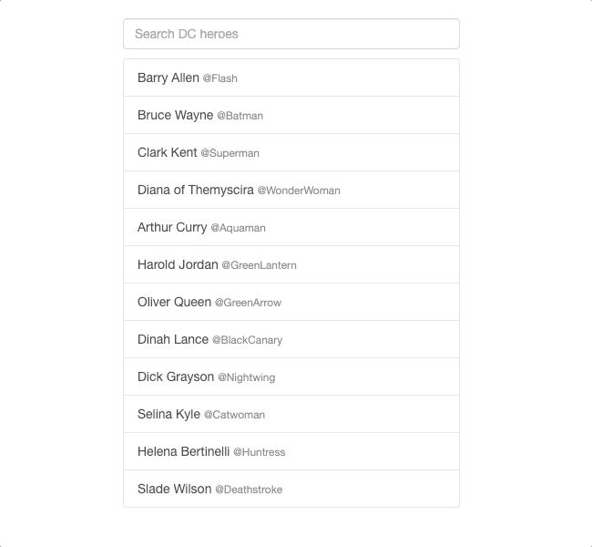

# List of searchable heroes

## Goal

The goal of the exercise is to build a searchable list using React and Redux.

Take a breath! There is no right or wrong implementation. Do your best to complete the tasks, the interesting and important part is going through the code when you submit your solution and discussing it as peers.

If you know a bit about debouncing, memoization, unit testing... don't be shy to show off your skills.

## Tasks

- I want to see the list of heroes
- I want to see a search field
- I want to filter the list while typing in the search field

## Requirements

There is only one technical requirement and it is to use Redux to build this app.

You have the freedom to choose any Redux helper libraries of course or you can go vanilla Redux. We recommand using redux sagas to handle the fake network call.

We provide the list of heroes in a db.json file and a fake api function to simulate the search request over the network.

You only need to `import { search } from './api'` to make your search request.

## UI requirements

Please do not use a React UI kit to build this app but you can use a CSS library if you'd like.

It's perfectly fine if there is no CSS.

## Running the app

Clone the repo and install the dependencies then lunch the app in dev mode using yarn or npm.

```
$ yarn | npm install
$ yarn start | npm start
```

## Example

Here's an example of an end result:


